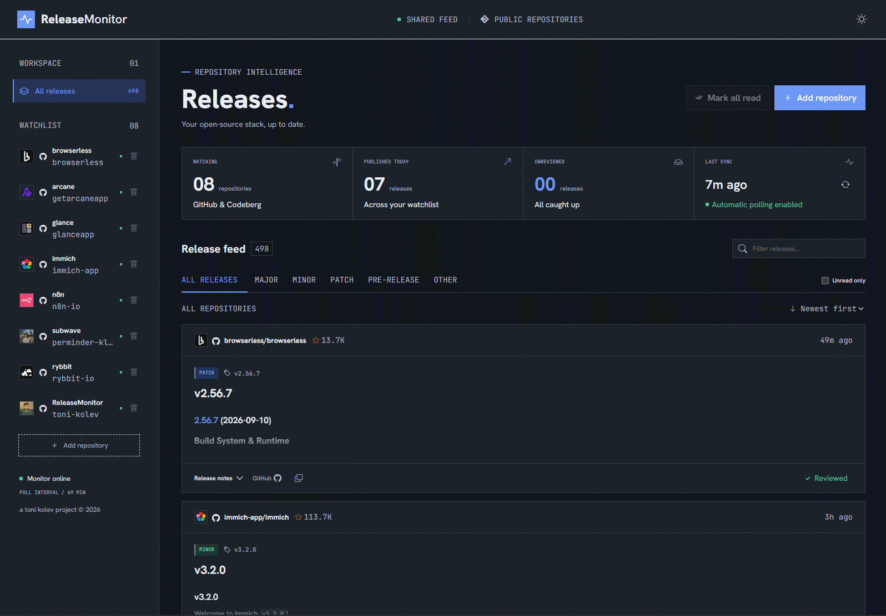

<center>


# ReleaseMonitor

Simple standalone page to track the releases of your favourite repositories and show them as a feed.




</center>

### Supported sources:
- GitHub
- Codeberg

## 🚀 Get started with Docker compose
Requires Docker Engine or Docker Desktop with Docker Compose v2. No source checkout or Node.js installation is needed. The image becomes available after the first release is published and its GHCR package is made public.

### Step 1: Create the Compose file

In an empty directory, create a file named `compose.yaml` with the following contents:

```yaml
services:
  releasemonitor:
    image: ghcr.io/toni-kolev/releasemonitor:${IMAGE_TAG:-latest}
    ports:
      - "${PORT:-6972}:3000"
    environment:
      GITHUB_TOKEN: ${GITHUB_TOKEN:-}
      CODEBERG_TOKEN: ${CODEBERG_TOKEN:-}
      SYNC_INTERVAL_MINUTES: ${SYNC_INTERVAL_MINUTES:-60}
    volumes:
      - release-data:/data
    restart: unless-stopped
    init: true
    read_only: true
    tmpfs:
      - /tmp
    cap_drop:
      - ALL
    security_opt:
      - no-new-privileges:true

volumes:
  release-data:
```

Open a terminal in that directory for the next step.

### Step 2: Start the container

```sh
docker compose up -d
```

### Step 3: Open ReleaseMonitor

Open http://localhost:6972 and select **Add repository**, then choose **GitHub** or **Codeberg**. Searches use the selected provider's public repository API through the backend.


### Updates and data

`latest` follows stable releases. For predictable upgrades, set `IMAGE_TAG=1.0.0` (or another published version, without the `v` prefix) in `.env` beside `compose.yaml`. After changing a pinned version, or to update `latest`, run:

```sh
docker compose pull
docker compose up -d
```

Data persists in the `release-data` named volume. Stop the app and back up the volume before upgrading. Keep the Compose directory/project name unchanged to reuse the same volume. `docker compose down` preserves data; `docker compose down -v` deletes it. A downgrade may require restoring a pre-upgrade backup if the database schema changed.


## ⚙️ Configuration

An optional `.env` file beside `compose.yaml` accepts the settings shown in [.env.example](.env.example):

| Variable | Default | Purpose |
| --- | --- | --- |
| `PORT` | `6972` | Host port |
| `IMAGE_TAG` | `latest` | Published image version, for example `1.0.0` |
| `SYNC_INTERVAL_MINUTES` | `60` | Polling interval for both providers, minimum 5 minutes |
| `GITHUB_TOKEN` | empty | Optional server-side GitHub token for higher API limits |
| `CODEBERG_TOKEN` | empty | Optional server-side Codeberg API token |

No GitHub token is required. Unauthenticated GitHub REST requests typically allow 60 requests/hour per outgoing IP, and repository search has a separate, lower limit. A server-side token is recommended for larger watchlists or frequent refreshes. Use a token with only public-repository read access; it is never sent to the browser. GitHub rate limits and outages are shown in the interface without discarding cached releases.

### 👉 How to get GitHub access token
1. Go to **GitHub**
2. Go to **Settings**
3. Go to **Credentials** in the **Access** section
4. Click on **Personal access tokens (classic)**
5. Click on **Generate new token**
6. Select **Generate new token (classic)**
7. Check `public_repo` scope
8. Generate and set in `.env` file

### 👉 How to get Codeberg access token
1. Go to **Codeberg**
2. Go to **Settings**
3. Go to **Applications**
4. Press **New access token**
5. Check **Public only** from **Repository and organizations access**
6. Select **Read** from **repository** dropdown

Each repository starts with up to 100 recent releases, excluding drafts and unpublished entries. Hourly polling uses conditional requests for GitHub and paginated requests for Codeberg, retaining previously fetched releases; this is not a complete historical import. Repositories publishing more than 100 releases between successful polls can have gaps. Private repositories are excluded. The watchlist is capped at 50 repositories across both providers. Manual refresh has a one-minute cooldown. Existing databases are automatically migrated while preserving GitHub repositories, cached releases, and read state; repository names and upstream IDs can overlap between providers.

Major/minor/patch labels classify the tag's semantic version (`2.0.0`, `2.1.0`, `2.1.1`), not a computed upgrade delta or a guarantee about breaking changes. Non-semver tags are labeled Other. Pre-releases are explicitly separated. Release notes render Markdown without raw HTML; remote embedded images are exposed as links.
